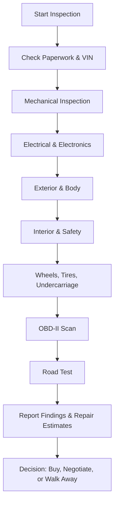

# Comprehensive Pre-Purchase Inspection (PPI) Summary

A **comprehensive pre-purchase inspection (PPI)** ensures a used vehicle is safe, mechanically sound, and worth the asking price. Below is a structured summary, checklist, and workflow.

---

## 1. Vehicle Background & Paperwork

- VIN check (dash, door jamb, engine bay)
- Service history review
- Accident/repair evidence
- Outstanding recalls

## 2. Mechanical Systems

**Engine**

- Oil & coolant leaks
- Fluid condition
- Compression/leak-down test (optional)
- Belts, hoses, mounts

**Transmission/Drivetrain**

- Fluid check
- Smooth shifting
- Transfer case & 4x4
- Differentials, driveshafts, CV/U-joints

**Suspension & Steering**

- Ball joints, tie-rods, bushings
- Shocks/struts
- Alignment, steering pull
- Power steering system

**Brakes**

- Pad/shoe life
- Rotor/drum wear
- Brake fluid
- ABS check

## 3. Electrical & Electronics

- Battery & charging system
- Alternator, starter
- Lights, wipers, horn
- HVAC & AC performance
- Infotainment/connectivity

## 4. Exterior & Body

- Paint thickness
- Rust (frame, rockers, wells)
- Windshield cracks
- Frame/bumper damage
- Door seals

## 5. Interior & Safety

- Upholstery & odor
- Power accessories
- Seatbelts, airbags
- Heated seats/wheel, HVAC
- Instrument cluster

## 6. Wheels, Tires, Undercarriage

- Tread depth & even wear
- Correct size/load rating
- Spare tire, jack, tools
- Wheel cracks/bends
- Exhaust & fuel/brake lines

## 7. Onboard Diagnostics (OBD-II)

- Stored & pending codes
- Check for resets
- Emissions readiness

## 8. Road Test

- Cold start, idle
- Acceleration & smoke
- Transmission/clutch
- Braking
- Steering feel
- 4x4 engagement
- Highway ride

---

# Pre-Purchase Inspection Checklist

✅ VIN matches across labels  
✅ Service records reviewed  
✅ Fluids checked (oil, coolant, transmission, brake, power steering)  
✅ No visible leaks (engine, transmission, differential)  
✅ Suspension & steering components tight  
✅ Brakes inspected (pads, rotors, fluid, ABS)  
✅ Tires even wear, correct load rating, spare present  
✅ Rust and structural integrity verified  
✅ Electrical systems tested (lights, HVAC, accessories)  
✅ Safety systems tested (airbags, seatbelts)  
✅ OBD-II scan completed, no hidden codes  
✅ Road test: cold start, idle, acceleration, braking, steering, 4x4, highway  

---

# Workflow Diagram

