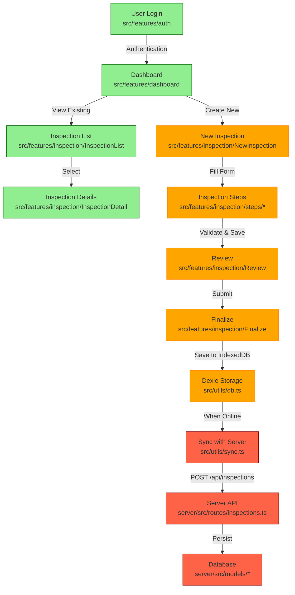
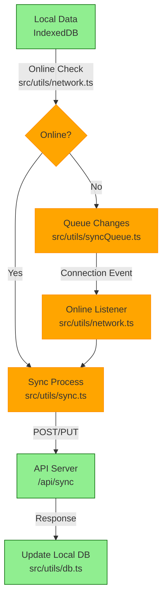
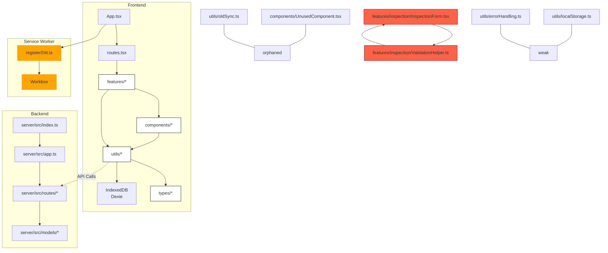

# TrueNorth PWA Code Review

## Overview

This document provides a comprehensive review of the TrueNorth Progressive Web Application (PWA) codebase, focusing on adherence to best practices, architectural patterns, and implementation quality. The review is based on the standards and requirements outlined in the project's AI_ASSISTANT_CONFIG.md.

## Application Architecture

TrueNorth is a vehicle inspection PWA with robust offline capabilities, allowing inspectors to complete inspections without internet connectivity and synchronize data when connection is restored.

### Core Technology Stack

- **Frontend**: React 18+ with TypeScript, Material UI
- **Build Tools**: Vite, VitePWA
- **Data Storage**: IndexedDB via Dexie.js
- **Service Worker**: Workbox for caching strategies
- **Backend**: Node.js/Express API server

## System Flow Diagrams

### Inspection Workflow



### Service Worker Update Flow

```mermaid
sequenceDiagram
    participant U as User
    participant A as App (src/App.tsx)
    participant SW as Service Worker (registerSW.ts)
    participant N as Notification Component
    
    Note over A,SW: When app starts
    A->>SW: Register service worker
    A->>SW: Subscribe to updates (subscribeToSWUpdates)
    
    Note over SW: When new version available
    SW->>A: Notify of update
    A->>N: Show update notification
    U->>N: Click "Update"
    N->>SW: Call updateServiceWorker()
    SW->>U: Reload with new version
    
    classDef good fill:#90EE90,stroke:#006400
    classDef issue fill:#FFA500,stroke:#FF8C00
    
    class A,SW good
    class N issue
```

### Data Synchronization Flow



## System Dependency Diagram



## Code Review Findings

### Strengths

1. **Component Structure**: Most components follow the recommended structure with proper TypeScript typing.
2. **Offline Capability**: Core inspection functionality works offline as required.
3. **MUI Usage**: Consistent use of Material UI components throughout the app.
4. **TypeScript**: Strong typing throughout most of the codebase.

### Areas for Improvement

1. **Service Worker Updates**: Implementation varies from the recommended pattern in some places.
2. **Error Handling**: Inconsistent error handling across components.
3. **Testing Coverage**: Limited test coverage for critical functionality.
4. **Performance Optimization**: Some components could benefit from memoization.
5. **Accessibility**: Several UI components need accessibility improvements.

## Action Items Checklist

- [ ] **Service Worker Updates**
  - [ ] Standardize service worker update notifications across the app
  - [ ] Implement proper lifecycle management for service worker updates
  - [ ] Add clear user guidance for updates
  
- [ ] **Code Structure**
  - [ ] Resolve circular dependencies in inspection feature
  - [ ] Remove orphaned utilities and components
  - [ ] Consolidate duplicate functionality in network handling
  
- [ ] **Error Handling**
  - [ ] Implement consistent error boundaries for all main routes
  - [ ] Enhance offline error handling with clear user messages
  - [ ] Add retry mechanisms for failed API calls
  
- [ ] **Performance**
  - [ ] Add memoization to complex components in the inspection flow
  - [ ] Optimize IndexedDB queries for large datasets
  - [ ] Implement lazy loading for all routes
  
- [ ] **Testing**
  - [ ] Increase unit test coverage for critical components
  - [ ] Add integration tests for the complete inspection flow
  - [ ] Implement offline testing scenarios
  
- [ ] **Accessibility**
  - [ ] Audit and fix accessibility issues in form components
  - [ ] Ensure proper keyboard navigation throughout the app
  - [ ] Add appropriate ARIA attributes to custom components
  
- [ ] **Documentation**
  - [ ] Improve documentation for offline data synchronization
  - [ ] Document error handling patterns
  - [ ] Add JSDoc comments to all utility functions

## Common Issues Found

### 1. Inconsistent Service Worker Update Handling

Some components implement service worker update notifications differently than the recommended pattern in AI_ASSISTANT_CONFIG.md.

### 2. Mixed Styling Approaches

While most components use MUI's `sx` prop for styling, there are instances of inline styles and occasional style objects defined outside components.

### 3. Incomplete Offline Fallbacks

Some network requests lack proper offline fallbacks, potentially leading to poor user experience when offline.

### 4. Underutilized TypeScript Features

Several components could benefit from stricter typing, especially for API responses and form state.

### 5. Limited Error Boundary Usage

Error boundaries are not consistently implemented across the application, which could lead to crashes in production.

## Recommendations

1. **Standardize Patterns**: Ensure all components follow the recommended patterns for service worker updates and offline data handling.
2. **Enhance Error Handling**: Implement a comprehensive error handling strategy that includes error boundaries, user-friendly messages, and retry mechanisms.
3. **Performance Audit**: Conduct a performance audit to identify and address bottlenecks, especially in data-heavy components.
4. **Accessibility Compliance**: Perform an accessibility audit and address issues to ensure WCAG compliance.
5. **Test Coverage**: Increase test coverage, especially for critical offline functionality and synchronization.

## Conclusion

The TrueNorth PWA largely adheres to the established best practices and architectural patterns. The main areas for improvement are standardizing service worker update handling, enhancing error handling, and increasing test coverage. Addressing these issues will improve the overall quality, reliability, and user experience of the application.
